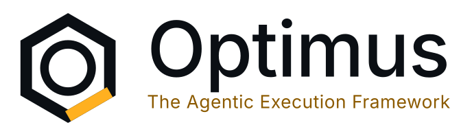

<p align="center">
  <picture>
    <source media="(prefers-color-scheme: dark)" srcset="assets/wordmark-dark.svg">
    
  </picture>
</p>

<p align="center">
  <strong>An agentic coding CLI that reads, writes, and runs — so you don't have to type the boring parts.</strong>
</p>

<p align="center">
  <a href="#install">Install</a> ·
  <a href="#why-optimus">Why Optimus</a> ·
  <a href="#features">Features</a> ·
  <a href="#quick-start">Quick start</a> ·
  <a href="#configuration">Configuration</a> ·
  <a href="#roadmap">Roadmap</a>
</p>

---

**Optimus** is a terminal-based coding agent: point it at a project, describe what you need in plain language, and it reads files, edits them, runs shell commands, and iterates — on its own, with you in the loop exactly as much as you want to be. It's a pair programmer that lives in your terminal, built by **BrightBrainCoder**.

This repo hosts the **compiled binaries** for every platform. The source is closed — see [Distribution](#distribution) for why, and what that does (and doesn't) mean for you.

## Why Optimus

- **You choose the model, not us.** Optimus talks to any Anthropic-compatible or OpenAI-compatible endpoint — Claude, GPT, Grok, a local `llama.cpp`/Ollama/vLLM/LM Studio server, or a gateway like OpenRouter. No vendor lock-in, no forced subscription to one lab.
- **A real permission model, not an all-or-nothing toggle.** Five modes — `manual`, `acceptEdits`, `plan`, `auto`, `bypassPermissions` — let you dial in exactly how much autonomy the agent has, per project, per session, or per command. `auto` mode has its own small model arbitrate ambiguous calls instead of interrupting you for everything.
- **Built for long sessions, not demos.** Context is actively managed: prompt caching cuts repeat-request cost, auto-compaction summarizes history before it overflows the model's window, and a live token/context gauge tells you where you stand — instead of silently truncating your conversation or crashing mid-task.
- **A terminal UI that's actually fast.** The interface is a from-scratch React renderer (no Ink, no dependency on a slower general-purpose TUI library) with a virtualized transcript, incremental diff rendering, and mouse support — smooth scrolling and typing even in a long-running session with heavy tool activity.
- **You can see and steer what it's doing.** Every tool call, every file edit, every shell command streams live with a real diff preview before it runs (in modes that ask). Nothing happens silently in the background.
- **Extensible without forking anything.** Skills, tools, and plugins are the framework's actual architecture, not an afterthought — see [Under the hood](#under-the-hood).

## Features

### Agent & safety

| | |
|---|---|
| **Permission modes** | `manual` (confirm everything) · `acceptEdits` (auto-apply file edits, still confirms shell/sensitive actions) · `plan` (read-only exploration, produces a plan file before anything executes) · `auto` (an LLM arbitrates ambiguous calls) · `bypassPermissions` (denylist only) |
| **Plan mode** | Explore and design without touching the filesystem; exits into an explicit approval step before any write happens |
| **Live confirmation prompts** | Diff previews for file edits, full command text for shell calls, before you approve |
| **Denylist safety net** | Dangerous commands and sensitive config files (`.git`, `.env`, shell rc files…) stay protected even in the most permissive mode |
| **Interruptible anytime** | Stop a running turn mid-generation or mid-tool-call with a keystroke |

### Context & performance

| | |
|---|---|
| **Prompt caching** | Automatic cache breakpoints on supported providers — repeat requests in a session cost a fraction of the first one |
| **Auto-compaction** | When a conversation approaches the model's context window, history is summarized by the model itself before it overflows — nothing crashes, nothing silently truncates |
| **Live context gauge** | Real-time token/context usage in the header, sourced from the provider's own usage reporting when available |
| **Virtualized transcript** | Long sessions with hundreds of tool calls stay smooth — only what's on screen is ever re-rendered |
| **Reasoning-effort control** | `/think off|low|medium|high|max` — tune how hard the model thinks per task, per session |

### Working with your project

| | |
|---|---|
| **File tools** | Read, write, and edit files with real diffs — edits are refused if the file changed since it was last read, so the agent never blindly overwrites concurrent changes |
| **Shell access** | Run arbitrary commands, with OS-level sandboxing (process + network isolation) on platforms that support it |
| **Search** | Fast grep/glob across the whole project, respecting `.gitignore` |
| **`@file` / `@directory` mentions** | Type `@` to reference a file or folder — its content is read automatically before your message reaches the model |
| **Task management** | Built-in persistent task list (`/tasks`), backed by disk, with live updates |
| **Session resume** | `/resume` picks up any past conversation, complete with its full transcript and context |
| **Project memory** | Auto-loads `AGENTS.md`/`CLAUDE.md` from your repo for project-specific instructions |

### Interface

| | |
|---|---|
| **10+ slash commands** | `/help`, `/sessions`, `/resume`, `/new`, `/think`, `/plan`, `/model`, `/compact`, `/tasks`, `/logs`, `/quit` |
| **Markdown rendering** | Full terminal markdown with syntax highlighting, tables, and themed colors — for both the agent's output and your own input |
| **Session log** | `Ctrl+L` opens a live, filterable log of every tool call and model event |
| **Themeable** | Six built-in palettes, including daltonized and high-contrast ANSI-16 variants |
| **Mouse support** | Click, scroll, drag-to-select, hyperlinks — a real terminal UI, not a text stream |

## Install

| Method | Command |
|---|---|
| **Homebrew** (macOS/Linux) | `brew install brightbraincoder/optimus/optimus-cli` |
| **Scoop** (Windows) | `scoop bucket add optimus https://github.com/brightbraincoder/optimus-releases` then `scoop install optimus/optimus-cli` |
| **AUR** (Arch Linux) | `yay -S optimus-cli-bin` (or your AUR helper of choice) |
| **winget** (Windows) | *coming soon* — [tracking PR](https://github.com/microsoft/winget-pkgs/pulls?q=is%3Apr+OptimusCli) |
| **Manual** | Download the binary for your platform from [Releases](https://github.com/brightbraincoder/optimus-releases/releases) |

Supported platforms: Windows, Linux, macOS — each on `x64` and `arm64`. Whichever method you use, the installed command is `optimus`.

Every release ships a `checksums.txt` (SHA-256) alongside the binaries — verify before you run anything you didn't build yourself.

## Quick start

```sh
cd your-project
optimus
```

First launch walks you through a short setup: pick a theme, accept the security notice, connect a provider (OAuth for Claude, or an API key for anything else), and choose a model. After that, just talk to it:

```
> add input validation to the signup form and write a test for it
```

Optimus reads the relevant files, makes the edit, runs your test suite, and reports back — asking for confirmation on anything sensitive, per your current permission mode (`Shift+Tab` cycles modes at any time).

Useful commands to know from day one:

- `/plan` — explore and design without any write reaching disk, then approve a plan before it executes.
- `/think high` — tell it to reason harder on something non-trivial.
- `/compact` — summarize the conversation now instead of waiting for the automatic threshold.
- `@src/auth.ts` — pull a file into context without describing it.
- `/resume` — come back to any past session.

## Configuration

Settings cascade from three layers, least to most specific:

1. `~/.optimus/config.json` — global defaults (theme, default permission mode, model classes…)
2. `<project>/.optimus/config.json` — per-project overrides (allow/deny rules, model, sandbox settings…)
3. Environment variables / CLI flags — highest priority, per invocation

The config file is self-documenting: every known setting is written out (as `null` when unset) the first time Optimus runs, so you can see everything that's tunable without hunting for docs. Nothing needs to be hand-authored to get started — `/settings` inside the app edits the same file for you.

## Under the hood

Optimus is built on an agentic framework with a genuinely pluggable core:

- **Loop plugins** — permission enforcement, auto-compaction, PII redaction, prompt-injection guarding, audit logging, and more, each hookable before/after any step of the agent loop, or able to insert entirely new steps.
- **Provider adapters** — any Anthropic-compatible or OpenAI-compatible HTTP endpoint works, including self-hosted ones; nothing assumes a specific vendor.
- **Skills** — bundles of instructions the agent loads on demand for a given kind of task, without bloating every request's system prompt.
- **Tools** — file I/O, shell, search, and task management ship built-in; the same framework can register more.

A desktop app (packaging the same agent core) is planned — see [Roadmap](#roadmap).

## Roadmap

- [ ] **winget** package — [submission PR open](https://github.com/microsoft/winget-pkgs/pull/426342), pipeline automation blocked on an upstream non-interactive-submission limitation in `wingetcreate` (tracked, not forgotten)
- [ ] **Desktop app** — the same agentic core, packaged as a native app rather than a terminal CLI
- [ ] AUR package activation

Found a bug or have a feature request? Open an issue on this repo.

## Distribution

**Optimus-Framework** (the source) stays private — this repo and its sibling [`homebrew-optimus`](https://github.com/brightbraincoder/homebrew-optimus) exist to distribute **compiled binaries and package-manager manifests only**. This doesn't affect what you can do with the CLI itself: it runs entirely on your machine, talks only to the LLM provider you configure, and every release is checksummed so you can verify what you're running.

## Versioning

Optimus follows [SemVer 2.0.0](https://semver.org). The version is computed directly from commit history — every release tag's notes on this repo list exactly what changed since the previous one.

## License

Optimus is proprietary software — © BrightBrainCoder. All rights reserved. Redistribution of the compiled binaries is permitted via the package managers listed above; the source is not licensed for reuse.

---

<p align="center"><sub>Built by <strong>BrightBrainCoder</strong></sub></p>
